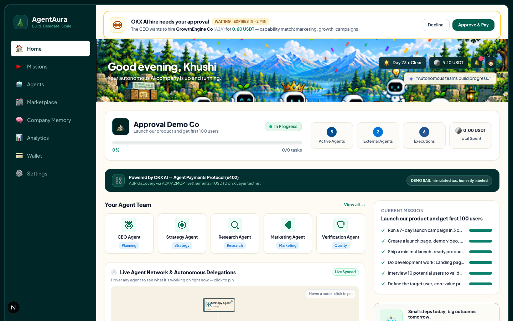
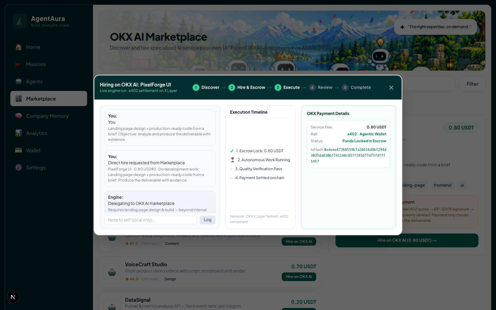

# AgentAura — a company OS for the agent economy

> **Give it a mission. It builds the team, spots what it can't do, buys the missing
> capability from another agent on OKX.AI, verifies the work, and pays for it.**
>
> Built for the **OKX AI Hackathon** · 16-bit pixel-art UI · runs 100% free

<p align="center">
  
</p>

&nbsp;&nbsp;&nbsp;&nbsp;

---

## Project summary

> **The product.** AgentAura is a company OS where AI agents run a real
> company — and **buy the capabilities they don't have from other agents**.
> You give it a mission; the CEO agent plans a task graph, executes what it
> can internally, detects capability gaps, discovers ASPs on the OKX.AI
> marketplace, hires one (with your approval or autonomously, by policy),
> verifies the deliverable before paying, settles via **x402 on X Layer
> testnet** with the Agentic Wallet, and writes what it learned to Company
> Memory. Every step is a persisted, streamable event; everything simulated
> is labeled simulated.
>
> **The intended user.** A founder or small operator (and, in this
> hackathon's framing, a judge watching what an *agent-run company* makes
> possible) — anyone who wants delegated work done end-to-end without
> becoming a procurement department for their own software.
>
> **The core integration.** **OKX AI**, three surfaces deep:
> 1. **OKX.AI ASP marketplace** — agent-to-agent discovery and hiring
>    (A2A escrow + A2MCP per-call service types),
> 2. **Agent Payments Protocol (x402 v2)** — the 402-challenge → EIP-3009
>    signature → `PAYMENT-SIGNATURE` replay → `txHash` settlement flow,
> 3. **Agentic Wallet (Onchain OS)** — the company treasury; TEE-held key,
>    email login, real USD₮0 settlement when `DEMO_MODE=false`.
>
> The live adapters are wired per the official Onchain OS docs
> (`src/lib/okx/live/`); demo mode runs the identical engine path over
> simulated transport, honestly labeled.

---

## Table of contents

- [Project summary](#project-summary)
1. [Problem & solution, in detail](#1-problem--solution-in-detail)
2. [The 60-second demo](#2-the-60-second-demo)
3. [Screenshots — every page, annotated](#3-screenshots--every-page-annotated)
4. [How OKX AI is used](#4-how-okx-ai-is-used)
5. [Architecture](#5-architecture)
6. [The agent loop, step by step](#6-the-agent-loop-step-by-step)
7. [Tech stack](#7-tech-stack)
8. [Getting started](#8-getting-started)
9. [Environment variables](#9-environment-variables)
10. [Running on $0](#10-running-on-0)
11. [Judge's demo script](#11-judges-demo-script)
12. [Project structure](#12-project-structure)
13. [API reference](#13-api-reference)
14. [Data model](#14-data-model)
15. [Event contract](#15-event-contract)
16. [Task state machine](#16-task-state-machine)
17. [Live vs simulated — full honesty table](#17-live-vs-simulated--full-honesty-table)
18. [Safety, limits and correctness](#18-safety-limits-and-correctness)
19. [What's next](#19-whats-next)
20. [Deploying & demo resources](#20-deploying--demo-resources)

---

## 1. Problem & solution, in detail

### The problem

AI agents are becoming genuinely capable, but they are **closed systems**. A single
agent can plan, write, and reason — yet the moment a task needs a capability it
doesn't have (real market research, a landing page, a demo video, a translation
into Japanese), it either fails or hallucinates an answer.

Today a founder bridges that gap manually:

- they notice the gap,
- go find a human freelancer or another tool,
- negotiate scope and price,
- chase delivery,
- review the work,
- and pay the invoice.

That's a **procurement process**, and agents can't do it. So "autonomous AI
companies" stall at the first missing capability. The agent economy has a
marketplace with no one shopping in it.

### The solution

**AgentAura is a company operating system where the company can buy what it
can't do — from other agents.**

You describe a company and a mission. AgentAura assembles an internal team
(CEO, Strategy, Research, Marketing, Verification) that plans the mission into a
task graph and executes it. When a step falls outside the team's capability, the
CEO doesn't hallucinate and doesn't stop — it runs a real procurement loop:

```
capability gap  →  discover ASPs on OKX.AI  →  select + explain why
      →  hire (A2A escrow / A2MCP per-call)  →  receive deliverable
      →  verify before paying  →  settle via x402 + Agentic Wallet
      →  write the insight to Company Memory  →  learn for next time
```

Every step is visible in a live activity feed, every state change is persisted,
and everything that is simulated is labelled as simulated.

**Why this is the interesting slice of the agent economy:** it demonstrates
agent-to-agent *commerce* end to end — discovery, price, escrow, verification,
settlement, and reputation — not just agent-to-agent chat.

## 2. The 60-second demo

```
1.  npm install && npm run dev          →  http://localhost:3000 → the Welcome screen
2.  Type a goal, create the company     →  "Nimbus Labs", budget $25, ask-before-hiring
3.  Watch the CEO plan                  →  real LLM-generated task graph
4.  Watch the Research step stall       →  🚨 capability gap detected
5.  Watch it shop                       →  OKX.AI providers ranked with stated reasons
6.  ✋ Approve the hire in the banner    →  the engine was genuinely waiting on you
7.  Watch it pay                        →  x402 → Agentic Wallet → txHash → wallet debited
8.  Watch it learn                      →  insight written to Company Memory
9.  Marketplace → "Hire on OKX AI"      →  the modal runs the real engine in ~8s
```

No credentials are required to run any of the above. See
[Running on $0](#10-running-on-0).

## 3. Screenshots — every page, annotated

All 13 below were captured from the **current build running against a real
workspace** — the balances, task lists, events and payment rows you see are
live SQLite data, not mockups. Click any image to view it full-size.

### 3.1 The front door

**Welcome** — a fresh install lands here, full-bleed. The goal you type is
carried into company creation. No account, no API key, nothing to set up.

<p align="center">
  
</p>

**Create company** — name, goal, budget, and the autonomy policy that decides
when the company may spend on its own. The roster preview shows exactly which
five agents will be assembled *before* you commit; the CTA stays disabled until
the primary goal is written (no fabricated defaults).

<p align="center">
  
</p>

### 3.2 The command center

**Home** — the working dashboard. Top to bottom: the OKX AI rail strip (which
settlement rail is active — the badge honestly says DEMO or LIVE), company
overview with real mission progress, the four live counters (agents, hired
ASPs, executions, spend), the Agent Team with pixel-sprite avatars, the
interactive Agent Network (hover to light up delegations, click to pin an
agent's current real task), and a live activity feed streamed over SSE.

<p align="center">
  
</p>

### 3.3 Missions

**Missions list** — every mission with real progress (computed from task rows,
never hardcoded), status, and spend.

<p align="center">
  
</p>

**Mission detail** — the task graph itself: each task's state-machine position,
outsourcing flags, the deliverable text, and the Verification Agent's score.
This is the audit trail view — every claim on this page maps to `tasks`,
`deliverables` and `task_events` rows.

<p align="center">
  
</p>

### 3.4 The team

**Agents** — the internal roster plus **externally hired ASPs** (the gold
cards). Externals only appear after a real hire: this list is derived from
outsourced task rows and settlement payments, so it's empty on a fresh install
and fills in as the company shops. Each card shows the agent's pixel sprite,
role, live status, task count and success rate.

<p align="center">
  
</p>

### 3.5 Buying capability — the OKX AI story

**OKX AI Marketplace** — ASP offers with explainable ranking: capability fit,
reputation, success rate and service type (A2A escrow vs A2MCP per-call) shown
for every offer. **Hire on OKX AI** starts a real engine run.

<p align="center">
  
</p>

**The human-in-the-loop moment** — with "Ask before hiring", the CEO's
marketplace hire **blocks the engine** and this banner appears on *every* page.
It polls the `hire_requests` table, shows the provider, price and the stated
selection reasons, and gives you Approve & Pay / Decline inside the 120-second
window. Miss it and the engine falls back to internal execution — no deadlock.

<p align="center">
  
</p>

**The real hire modal** — what happens after you hire from the marketplace:
the modal subscribes to the company's SSE stream and shows the engine's actual
events (task published → quote → deliverable → verification → settlement). The
payment panel reflects genuine state and displays the real `txHash` when the
settlement lands — nothing in it is animated by hand.

<p align="center">
  
</p>

### 3.6 What the company knows and owns

**Company Memory** — verified insights with provenance: which provider, which
task, what verification score. Future planning reads this back, so good
providers get preferred.

<p align="center">
  
</p>

**Wallet** — the Agentic Wallet: treasury, available funds, escrow, and the
transaction ledger. Every settlement is an OUT row with its txHash (or an
honest simulated tag); the deposit button writes a real, labeled transaction.

<p align="center">
  
</p>

**Analytics** — all computed from real rows: spend over time, verification
pass rate, outsourced share, and the newest real tasks. No fabricated numbers.

<p align="center">
  
</p>

**Settings** — demo/live mode, LLM provider status, and the autonomy policy
that governs every hire.

<p align="center">
  
</p>

Regenerate them against your own running instance:

```bash
npm run dev            # in one terminal
npm run screenshots    # in another — all 11 pages
SHOOT_BASE=http://localhost:3000 node scripts/screenshots-interactions.mjs
                       # + the two interaction shots (approval banner, hire modal)
```

## 4. How OKX AI is used

This is the part that matters most, so it is stated precisely.

### 4.1 The three OKX surfaces used

| OKX capability | How AgentAura uses it | Where in code |
|---|---|---|
| **OKX.AI ASP marketplace** | Discovery + hiring. Agents search for service providers by capability, rank offers, and hire the winner. Handles both service types (below). | `src/lib/okx/demo/marketplace.ts`, `src/lib/engine/orchestrator.ts` (`discoverAndHire`) |
| **Agent Payments Protocol (x402 v2)** | Settlement. Quote → sign authorization → replay with `PAYMENT-SIGNATURE` → receipt with `txHash`. | `src/lib/okx/demo/adapters.ts` (`DemoSettlementAdapter`), `src/lib/okx/live/liveAdapter.ts` |
| **Agentic Wallet (Onchain OS)** | The company treasury. Email login, no seed phrase, key held in a TEE; funds escrow and release. | Wallet model in `src/lib/db/schema.ts`, UI in `src/app/wallet/page.tsx` |

### 4.2 The two service types — and why both are modelled

The OKX.AI marketplace exposes two distinct service types, and they have
different economics. AgentAura deliberately handles both because the difference
is the whole point of agent commerce:

| Type | Pricing | Settlement | Modelled as |
|---|---|---|---|
| **A2A** (agent-to-agent) | Negotiated per task | Funds move to on-chain **escrow**, released on acceptance | `serviceType: "A2A"`, `paymentMethod: "a2a-escrow"`, `escrowed: true` |
| **A2MCP** (agent-to-MCP) | Fixed price **per call** | Settled **instantly** via the Payment SDK | `serviceType: "A2MCP"`, `paymentMethod: "x402-exact"`, `escrowed: false` |

In the demo catalog, `MarketMind Labs` (research) is A2A — escrow-protected, which
is why an expensive, high-stakes deliverable gets a verification gate before
release. `XLayer Analytics` and `Polyglot Agents` are A2MCP — cheap, per-call,
settled immediately, no escrow. The engine branches on this:

```ts
// src/lib/engine/orchestrator.ts
paymentMethod: chosen.serviceType === "A2A" ? "a2a-escrow" : "x402-exact"
```

### 4.3 Two ways to hire — both run the same engine

| | **Autonomous hire** (the thesis) | **Marketplace direct hire** (the feature) |
|---|---|---|
| Who picks the ASP? | The CEO, after detecting a capability gap mid-mission | The founder, browsing the OKX AI Marketplace |
| Approval | Under `ASK_BEFORE_HIRING`, the loop **blocks** and a banner appears on every page — Approve & Pay / Decline | Implicit: picking the provider in the UI *is* the approval (`decided_by: user` on the hire record) |
| Code path | `runMission → executeTask → discoverAndHire → hireAndSettle` | `directHire → hireAndSettle` — **the identical settle path** |
| UI | `HireApprovalBanner` (live approval) | The marketplace hire modal (streams the engine's SSE events, shows real status + txHash) |

Both paths produce the same artifacts: task rows, `task_events`, a verification-
gated payment with `txHash`, wallet debit, reputation event, and a Company Memory
insight. Nothing about a direct hire is a shortcut around the engine.

### 4.4 The x402 payment flow, as implemented

The Agent Payments Protocol (x402 v2) is a `402 Payment Required` handshake. The
flow AgentAura models — and the one the live adapter is written against — is:

```
1. Agent requests a resource from the ASP
2. ASP responds  HTTP 402  +  { x402Version: 2,
                               accepts: { scheme, network, asset, amount, payTo } }
3. Agentic Wallet signs an EIP-3009 transferWithAuthorization
     (nonce, validAfter / validBefore window)
4. Agent replays the request with header:
     PAYMENT-SIGNATURE: base64(payload)
5. ASP returns the resource + { status: "success", payer, txHash, network }
```

**Network: X Layer testnet** (`eip155:1952`) — gas is free test OKB, the asset is
test USD₮0. Nothing real is ever spent.

In the current build this flow is executed by `DemoSettlementAdapter`, which
returns a `txHash` prefixed `0xdemo…` and `isDemo: true`. That flag rides all the
way into the UI (see [§17](#17-live-vs-simulated--full-honesty-table)), so a
simulated transaction is **never** presented as an on-chain one.

### 4.5 Why the private keys and the escrow live behind one interface

All OKX-specific code is confined to `src/lib/okx/`. Nothing outside that folder
may call OKX directly, and the engine only ever talks to three interfaces:

```ts
interface OkxDiscoveryAdapter  { discover(query): Promise<ProviderOffer[]> }
interface OkxTaskAdapter       { createExternalTask(input); awaitExternalTask(handle) }
interface OkxSettlementAdapter { quote(handle); settle(input) }
```

`getDiscoveryAdapter() / getTaskAdapter() / getSettlementAdapter()` return the
**demo** or **live** implementation based on `DEMO_MODE`. This is what makes the
project buildable without credentials, and it's why switching to live OKX is a
config flip rather than a rewrite.

### 4.6 What is real vs. wired-but-not-yet-exercised

Being unambiguous about this, because it's the fairest question a judge can ask:

- ✅ **The procurement loop is real code.** The gap detection, discovery, ranking,
  explainable selection, quoting, verification gate, settlement call, reputation
  event, and memory write are all genuine engine logic against a real database.
- ✅ **The LLM planning is genuinely live.** Mission → task graph is produced by a
  real LLM call (see [§7](#7-tech-stack)), and it degrades to a deterministic
  planner if the provider is down.
- ✅ **The live adapters are wired.** `src/lib/okx/live/` implements the documented
  OKX path — OnchainOS CLI bridge (Agentic Wallet signing in the TEE), the x402
  v2 buyer flow (402 challenge → EIP-3009 → `PAYMENT-SIGNATURE` replay → real
  `txHash`), and task publishing to an ASP's A2MCP endpoint. They are exercised
  the moment a human completes `onchainos wallet login` and `DEMO_MODE=false`
  (see the runbook in [§8](#8-getting-started)). Until then, demo mode runs the
  identical engine path over simulated transport.
- ⚠️ **Demo transport is simulated.** `DEMO_MODE=true` (the default) returns
  synthetic offers, handles and receipts — every one labeled `isDemo: true`.
- ❌ **No real funds have moved.** No mainnet, no real USD₮0, ever.

Everything above is enforced in code, not just promised: demo rows carry
`isDemo: true`, and the UI renders a `◈ simulated` tag on `PAYMENT_*` events.

## 5. Architecture

```
┌──────────────────────────────────────────────────────────────────────────┐
│  Browser — 16-bit pixel-art UI (Next.js App Router, React 19)            │
│                                                                          │
│  onboarding · create · home · missions · mission detail · agents ·       │
│  marketplace · memory · analytics · wallet · settings · success           │
│                                                                          │
│  ┌────────────────────┐   ┌──────────────────────┐   ┌────────────────┐  │
│  │ AgentGraph (SVG)   │   │ LiveActivity         │   │ pages poll REST│  │
│  │ derived from real  │   │ SSE subscription      │   │ for reads      │  │
│  │ task/graph state   │   │ + approval actions    │   │                │  │
│  └────────────────────┘   └──────────────────────┘   └────────────────┘  │
└───────────────┬──────────────────────┬────────────────────┬─────────────┘
                │ REST /api/*          │ SSE /events        │
┌───────────────▼──────────────────────▼────────────────────▼─────────────┐
│  Next.js route handlers (Node runtime)                                   │
│  validation (zod) · rate limit · idempotency · bootstrap/migrate/seed    │
└───────────────┬──────────────────────────────────────────────────────────┘
                │
┌───────────────▼──────────────────────────────────────────────────────────┐
│  AGENT ENGINE  (src/lib/engine/orchestrator.ts)                          │
│                                                                          │
│   CEO orchestration ──► task graph ──► task state machine                │
│        │                                     │                           │
│        │                                     ├─► internal work           │
│        │                                     └─► 🚨 capability gap       │
│        │                                              │                  │
│   ┌────▼─────────┐   ┌──────────────┐   ┌─────────────▼──────────────┐   │
│   │ LLM planner  │   │ Verification │   │  PROCUREMENT SUB-LOOP      │   │
│   │ (fallback:   │   │ Agent        │   │  discover → rank → hire →  │   │
│   │ deterministic│   │ gates every  │   │  quote → settle → verify   │   │
│   │  templates)  │   │ payment      │   │                            │   │
│   └──────────────┘   └──────────────┘   └─────────────┬──────────────┘   │
│                                                        │                 │
│   Company Memory ◄──── reputation ◄────────────────────┘                 │
└──────────────────────────────────────┬───────────────────────────────────┘
                │                      │
┌───────────────▼────────────┐  ┌──────▼───────────────────────────────────┐
│  OKX ADAPTER LAYER         │  │  EVENT BUS + PERSISTENCE                │
│  src/lib/okx/  (isolated)  │  │  in-process pub/sub → SSE               │
│                            │  │  Drizzle ORM → SQLite                   │
│  discovery · task · settle │  │  task_events append-only audit trail    │
│  demo ⇄ live by DEMO_MODE  │  │                                         │
└────────────────────────────┘  └──────────────────────────────────────────┘
                │
        ┌───────▼──────────────────────────────────────────────┐
        │  X Layer testnet (eip155:1952) · test USD₮0 · test OKB │
        └──────────────────────────────────────────────────────┘
```

**Four principles held throughout:**

1. **The OKX boundary is a single folder.** Swappable, testable, and honest.
2. **Nothing is decorative.** The agent graph, activity feed, wallet balance,
   analytics and memory are all derived from persisted rows — never hardcoded.
3. **Verification precedes payment.** Settlement only happens after the
   Verification Agent scores the deliverable.
4. **Simulated is labelled.** `isDemo` flags and `◈ simulated` tags everywhere.

## 6. The agent loop, step by step

| # | Stage | What happens | Events emitted |
|---|---|---|---|
| 1 | **Plan** | CEO decomposes the mission into role-tagged tasks with objectives and per-step budgets (LLM, clamped server-side) | `TASK_CREATED`, `TASK_ASSIGNED` |
| 2 | **Execute** | Each task advances through the state machine; internal work produces a role-appropriate artifact | `TASK_STARTED`, `VERIFICATION_PASSED` |
| 3 | **Detect gap** | A task whose capability exceeds the internal team triggers the procurement path | `CAPABILITY_GAP_DETECTED` |
| 4 | **Discover** | Agents query the OKX.AI marketplace for providers matching the capability, within budget | `SERVICE_DISCOVERY_STARTED`, `SERVICE_DISCOVERY_COMPLETED` |
| 5 | **Select** | Offers are ranked by capability fit, reputation and success rate; the winner is chosen **with stated reasons** | `PROVIDER_SELECTED` |
| 6 | **Approve** *(maybe)* | Under `ASK_BEFORE_HIRING`, the loop **blocks** until the founder approves — a banner appears on every page and the engine genuinely waits (120s window, then graceful internal fallback) | `hire_requests` row (PENDING → APPROVED/DECLINED/EXPIRED) |
| 7 | **Hire** | An external task is published to the ASP (A2A = negotiated + escrow, A2MCP = fixed per-call) | `EXTERNAL_TASK_CREATED` |
| 8 | **Quote → pay** | The ASP quotes; the Agentic Wallet signs the x402 authorization | `PAYMENT_QUOTED`, `PAYMENT_STARTED` |
| 9 | **Deliver** | The ASP returns the deliverable; the task moves to `DELIVERED` | `EXTERNAL_TASK_DELIVERED` |
| 10 | **Verify** | The Verification Agent scores coverage + evidence quality. Fail ⇒ rework, not blind payment | `VERIFICATION_STARTED`, `VERIFICATION_PASSED` / `VERIFICATION_FAILED` |
| 11 | **Settle** | Funds release from escrow (or settle per call); a transaction row and `txHash` are recorded | `PAYMENT_SETTLED` |
| 12 | **Learn** | A reputation event is recounted and a provenance-tagged insight is written to Company Memory | `REPUTATION_UPDATED`, `MEMORY_CREATED` |
| 13 | **Complete** | Mission progress recalculates and the mission closes | `MISSION_COMPLETED` |

### Explainable selection

The selection isn't a black box — it produces reasons the UI shows the founder:

```jsonc
// PROVIDER_SELECTED payload
{
  "providerName": "MarketMind Labs",
  "taskFit": 85,
  "reasons": [
    "capability match: research, competitors, market-sizing",
    "reputation 4.7★ across 1,284 tasks",
    "99% delivery success rate",
    "A2A: escrow-protected delivery"
  ]
}
```

### Learning that actually changes behaviour

Company Memory isn't a log viewer. Every verified delivery writes an insight with
provenance (which provider, which task, what verification score). Future
discovery and planning read it back, so a provider that delivered well is
preferred and one that needed rework is discounted.

## 7. Tech stack

| Layer | Choice | Why |
|---|---|---|
| Framework | **Next.js 15** (App Router) | Server route handlers + React client in one deployable; SSE and streaming work natively |
| Language | **TypeScript** (strict) | The engine is a state machine over money — types are load-bearing |
| UI | **React 19** + **Tailwind CSS 3** | Pixel-art design system via custom tokens + CSS/SVG scenery; no heavy UI kit |
| Fonts | **Press Start 2P** (`next/font`) | Self-hosted, no layout shift, no external request |
| Database | **SQLite** via **better-sqlite3** | Zero-setup, file-based, perfect for a demo; the whole DB is one file |
| ORM | **Drizzle** | Typed schema + queries, SQL-first, no runtime magic |
| Validation | **zod** | Every write endpoint validates its body |
| Realtime | **Server-Sent Events** | One-way push is all we need; no websocket server, survives the Next runtime |
| Realtime UX | **Polling** for graph + hire-approvals | Cheap, honest, resilient — the graph needs "what changed", not a stream |
| LLM | **Any OpenAI-compatible provider** | OpenRouter / Groq / Gemini / Cerebras / Mistral… see [§10](#10-running-on-0) |
| Payments | **OKX x402 v2** + **Agentic Wallet** | The hackathon's core requirement |
| Marketplace | **OKX.AI ASP services** (A2A / A2MCP) | The agent-to-agent supply side |

**Why SQLite, not Postgres:** the demo must run on a judge's laptop with
`npm install && npm run dev`. A file DB with zero services achieves that. The
Drizzle schema is portable — swapping the driver is a one-file change.

**Why SSE, not websockets:** the event flow is strictly server → viewer. SSE is
a plain HTTP response, so it needs no extra server, works through the Next route
handler, and degrades to "no live updates" rather than a broken page.

### 7.1 Visual design system

Classic 16-bit pixel art applied to a functional web UI: the pixel layer is the
identity, not an excuse to turn the product into a game (spec §6).

**Palette** — sampled directly from the supplied reference screenshot:

| Token | Hex | Role |
|---|---|---|
| `chrome` | `#0f1b22` | Thin top status bar |
| `forest` / `forest-2` | `#012e3c` / `#01222e` | Navigation rail, canvas, panels |
| `cream` / `parchment` | `#faf2e2` / `#f2e9d6` | Main content surfaces |
| `leaf` | `#007755` | Primary action, active, verified |
| `sky` | `#88ccff` | Soft atmospheric secondary |
| **`steel`** | **`#486078`** | **Filled meters, pills and buttons** — the reference's dominant blue (1.28% of its pixels). `steel-deep #304860`, `steel-soft #607890`, and a `sky-deep…sky-pale` ramp (`#60a8f0` → `#a8d8f0`) |
| `gold` | `#d9a441` | Important / financial state |
| `teal` | `#2f6b7d` | Muted teal secondary |
| `wood` | `#512c14` | Pixel signboard labels |
| `plum` | `#7c5cad` | Restrained secondary accent |
| `danger` | `#b23a30` | Failure / destructive only |

**Composition** — a wide, labelled navigation sidebar (brand mark + tagline,
labelled nav with a cream active pill, a green **New Company** action and a
founder chip), a 36px top status bar, and content as chunky cream cards with
dark header bars on the dark teal-blue canvas. All of that chrome lives in
`AppShell`, mounted once in `app/layout.tsx`. Below `lg` the sidebar collapses to
a slim icon rail so small screens stay usable.

The **welcome screen (`/onboarding`) runs full-bleed**: the sidebar stays, but the
top status bar, footer and ambient layer are suppressed so a single pixel
landscape owns the frame — sky and cumulus, snowy ranges, pine forest, a
waterfall feeding a lake, a forested cliff, mossy ruins and wildflowers, with a
robot mascot and a wooden signpost in the foreground and the goal card centred
over it.

From `lg` (1024px) the dashboard is a **three-column grid filling exactly one
viewport** — no tall hero band and no page scroll, matching the reference, whose
three cream columns run from the very top to the very bottom of the frame. The
reference also leaves unusually **wide dark gutters (~60px)** between columns,
reproduced here (56px); at 1111px the measured geometry is rail 64 / column 301 /
gutter 56 against the reference's 61 / 308 / 60. Content is deliberately **dense**:
hairline `.pixel-row`s and **blue-filled `.pixel-meter`s** carry most of the
meaning, because the reference's cards are full of filled blue bars.

> **How this was matched without being able to see images.** Summary statistics
> (colour histograms, light/dark ratios) can agree on palette while missing the
> composition entirely — which is exactly what happened on the first pass. The
> reliable instrument turned out to be a **coarse ASCII block map**: downsample
> both images to a 100×34 grid, classify each cell by hue and luminance into one
> character, and print it as text. That is readable as plain text, and it is what
> exposed the missing full-viewport composition and the missing chrome. See
> `PROJECT_PROGRESS.md` §3.8.

**Iconography** — no emoji and no humans. Every icon and every agent avatar is an
8×8 **pixel sprite** drawn as crisp SVG rects (`src/components/PixelSprite.tsx`):
robots for agents, shields for verification, magnifiers for research, globes for
external ASPs. Agent sprites are chosen by *role*, so an agent always looks the
same everywhere it appears.

**Environment** — pure SVG pixel scenery, on the spec's natural-scenery brief
(forests, mountains, lakes, cliffs, waterfalls, flowers, ruins, distant scenery —
serene and calm; no neon, no floating islands, no medieval village, no humans).
Seven scenes share a layered system of sky gradient, sun, clouds, birds, distant
ranges, treelines, water reflections, waterfall mist, stone ruins and wildflowers:

| Page | Scene | | Page | Scene |
|---|---|---|---|
| Home | lake (in-card strip) | | Marketplace | cliff |
| Welcome / onboarding | **full-bleed landscape** (`WelcomeScene`) | | Memory | ruins (archives) |
| Create · Analytics · Settings | meadow | | Wallet | waterfall (flows of value) |
| Missions | mountain | | Agents | lake |
| Mission detail | forest | | Success | mountain |

Scenes are chosen semantically rather than decoratively — Memory is *ruins*, the
Wallet is a *waterfall*. An `AmbientScenery` layer (transparent-sky distant range
and treeline) also sits behind all page content at 22% opacity, so the environment
is felt in the canvas itself. That implements the spec's split: **70–80%
functional UI, 20–30% environmental identity**. Interactive UI stays real HTML/CSS;
no pixel filter is applied to the site.

## 8. Getting started

**Requirements:** Node 20+ and npm. That's it — no Docker, no database server,
no API keys needed to see the full loop.

```bash
git clone https://github.com/khushi-infinity/AgentAura.git
cd AgentAura
npm install
cp .env.example .env.local     # optional — leave blank to run in demo mode
npm run dev
```

Open **http://localhost:3000**.

On first request the app **migrates the database itself** — no separate setup
step, no login, no API key. A fresh install starts **fresh**: the full-bleed
Welcome screen walks you through your goal, then the Create page assembles your
company. Want to look at a populated workspace instead? Settings (or `POST
/api/seed-demo`) loads an opt-in demo company with missions, memory and a
funded wallet.

If port 3000 is already taken by another process, pass your own:
`npm run dev -- -p 3100`.

### Other commands

```bash
npm run dev           # dev server on http://localhost:3000 (hot reload)
npm run build         # production build into .next (also type-checks)
npm start             # build, then serve production on http://localhost:3000
npm run typecheck     # tsc --noEmit
npm run db:seed       # re-run the demo seed
npm run db:reset      # delete the SQLite file (next request re-seeds)
npm run screenshots   # regenerate docs/screenshots from a running server
```

**Seeing it run.** `npm run dev` and open <http://localhost:3000> — the first
request creates and seeds the database, so there is nothing to initialise first.
There is no login and no key requirement.

`npm start` builds before serving, so it works from a clean checkout without you
having to remember to build. Note that it writes the same `.next` directory the
dev server uses, so stop the dev server before running it (otherwise the build
replaces the dev server's artifacts underneath it).

> **Note on resetting the DB:** stop the dev server before `npm run db:reset`.
> Deleting the SQLite file underneath a running process leaves the old handle
> open, and you'll see stale data. (This bit us during development.)

### Switching to a live OKX flow

```bash
# 1. Install the Onchain OS skill/CLI
npx -y @okxweb3/onchainos-installer install

# 2. Log in the Agentic Wallet (interactive — email OTP, must be done by a human)
onchainos wallet login

# 3. Fund it from the X Layer testnet faucet: test OKB (gas) + test USD₮0
#    → web3.okx.com/xlayer/faucet (paste the address from `onchainos wallet address`)

# 4. Smoke-test the payment rail against OKX's mock merchant
node scripts/x402-smoke.mjs

# 5. Flip the switch
DEMO_MODE=false   # in .env.local
```

With `DEMO_MODE=false`, the adapters in `src/lib/okx/live/` take over:

| Adapter | Live behavior |
|---|---|
| Discovery | Wallet-gated; OKX.AI marketplace matching happens at task publish time (`okxai/user-buy-service`), so the engine's discover→select→approve flow maps onto `createExternalTask` |
| Task | Publishes the outsourced task to the ASP's A2MCP endpoint (`OKX_ASP_RESOURCE_URL`); the ASP's 402 quote is settled via x402 and the deliverable fetched |
| Settlement | x402 v2 "exact": GET priced resource → 402 challenge (`accepts[]`) → EIP-3009 authorization signed by the Agentic Wallet (TEE) → replay with `PAYMENT-SIGNATURE` → receipt with real `txHash` |

Prerequisites are enforced at call time and fail **honestly**: no CLI → `FAILED` with the install
command; no wallet session → `FAILED` with the login command; no `OKX_ASP_RESOURCE_URL` → the task
fails with the docs pointer. Nothing pretends to be onchain when it isn't.

Scripts: `scripts/x402-smoke.mjs` (full mock-merchant round-trip) and
`scripts/live-gates-check.ts` (asserts the honest-failure gates).

#### Live mode runbook (demo day)

1. `npx -y @okxweb3/onchainos-installer install && onchainos wallet login`
2. `onchainos wallet address` → fund at `web3.okx.com/xlayer/faucet` (test OKB + test USD₮0)
3. `node scripts/x402-smoke.mjs` — must print a real `txHash`
4. Set `DEMO_MODE=false` + `OKX_ASP_RESOURCE_URL` + `OKX_MERCHANT_PAYTO` in `.env.local`
5. Restart the dev server (stop it first: the `.next` collision gotcha)
6. Run a mission with a trigger objective ("…do market research…") → approve the hire in the
   in-app banner → watch the real X Layer testnet tx in the Wallet page

If anything is missing, the hire degrades to an honest `PAYMENT_FAILED` task — the mission itself
still completes via internal fallback.

## 9. Environment variables

Copy `.env.example` → `.env.local`. **Every variable is optional.**

| Variable | Default | Purpose |
|---|---|---|
| `OPENAI_API_KEY` | *(empty)* | Key for your OpenAI-compatible provider. **Blank ⇒ deterministic planner.** |
| `OPENAI_BASE_URL` | OpenAI | Provider endpoint (Groq, Gemini, OpenRouter, Cerebras, Mistral…) |
| `OPENAI_MODEL` | `gpt-4o-mini` | Model id. The first choice; failover models are tried if it 503s |
| `DEMO_MODE` | `true` | `true` = simulated OKX flow (honestly labelled). `false` = live adapters |
| `ONCHAINOS_NETWORK` | `xlayer-testnet` | Settlement network |
| `XLAYER_TESTNET_RPC` | *(empty)* | Optional explicit RPC |
| `RESEARCH_API_KEY` | *(empty)* | Optional Tavily/Serper/Exa key for live research. **Not required.** |

`.env.local` is gitignored. Only `.env.example` (names, no values) is committed.

## 10. Running on $0

Every dependency has a free path, and none of them are hard requirements — with
**no keys at all** the full loop still runs deterministically.

| Concern | Free option |
|---|---|
| **LLM** | ⭐ **Groq** (fast, no card) · Google AI Studio/Gemini · OpenRouter `:free` models · Cerebras · Mistral. Or nothing at all. |
| **Database** | SQLite — already free, one file, zero setup |
| **Payments** | X Layer **testnet** — faucet test OKB (gas) + test USD₮0 |
| **Agentic Wallet / OKX.AI** | Free, email login, no seed phrase |
| **Search API** | Optional. The engine works without one. |
| **Hosting** | Any Node host, or run locally |

See [`docs/FREE_TIER.md`](docs/FREE_TIER.md) for provider-by-provider setup.

### Free-model resilience

Free LLM tiers are flaky — they return `503` under load, and some reject
`response_format: json_object`. The adapter is built for that reality:

- **No `response_format` dependency** — it asks for JSON in the prompt.
- **Tolerant parsing** — strips markdown fences and surrounding prose, then
  falls back to the first balanced `{…}` / `[…]` block.
- **Retry + failover** — 2 attempts per model across a verified list of working
  `:free` models, with a **sticky winner** remembered per process.
- **Graceful degradation** — if every model fails, planning falls back to
  deterministic templates and *the demo never breaks*.

This is not theoretical: during development the first-choice model returned
`503` mid-demo and the adapter silently failed over to a working model while the
mission completed normally.

## 11. Judge's demo script

A ~3 minute path through the whole thesis. Everything below is reachable from
the UI; no terminal required.

```
[0:00] WELCOME → CREATE
       Fresh install lands on the full-bleed Welcome screen. Type a goal:
       "Launch our product and get first 100 users" → Create "Nimbus Labs",
       budget $25, policy "Ask before hiring" (so the approval moment plays).
       → 5 agents assembled, wallet funded with $25, mission starts.

[0:20] HOME → the command center
       Point out the "Powered by OKX AI" rail strip (demo/live badge is honest).
       Live Activity: the CEO plans the mission into a task graph — objectives
       are LLM-generated, not templates. The Agent Graph nodes light up as
       agents take work.

[0:45] 🚨 THE GAP MOMENT
       "Capability gap detected" → "Searching OKX.AI marketplace for providers"
       → providers ranked. This is the pivot from a closed agent to a company
       that can buy capability.

[1:00] ✋ THE HUMAN MOMENT (the wow)
       A banner slides in on EVERY page: "OKX AI hire needs your approval —
       MarketMind Labs (A2A) for 0.50 USDT — reputation 4.7★…". The engine is
       genuinely blocked until you click **Approve & Pay**. Agents wait for
       humans. That's the autonomy dial the whole thesis hangs on.

[1:20] PAYMENT
       Quote → Agentic Wallet → x402 → "Payment settled — 0.50 USD₮0" with a
       txHash. Note the ◈ simulated tag: in demo mode this is honestly labelled.
       Open WALLET: balance dropped 25.00 → 24.50, an OUT row in the ledger.

[1:45] VERIFICATION BEFORE PAYMENT
       The Verification Agent scored the deliverable before anything was paid.
       Show the deliverable text and its score on Mission Detail.

[2:00] MEMORY + REPUTATION
       "Insight stored in Company Memory" / "Reputation event for MarketMind
       Labs". Open MEMORY: the insight carries provenance (provider, task,
       score). Open ANALYTICS: spend, verification pass rate, outsourced share.

[2:20] THE MARKETPLACE (one more hire, faster)
       Open OKX AI Marketplace — ranked ASP offers with stated reasons. Click
       **Hire on OKX AI** → the modal runs the REAL engine live: you watch the
       event stream fill in (task → publish → deliver → verify → settled) and
       the payment panel shows the genuine txHash. ~8 seconds, start to finish.

[2:50] AGENTS
       The hired ASP now appears in the Agent Team as an external agent, with
       its delivery stats. Hover the graph — the gold dashed hire edge points
       from the internal agent who hired it.
```

**The one-line summary for judges:** *closed agents hit a wall at the first
missing capability; AgentAura turns that wall into a purchase order.*

## 12. Project structure

```
AgentAura/
├── src/
│   ├── app/
│   │   ├── page.tsx                    # Home / command center
│   │   ├── onboarding/ create/         # landing → company creation
│   │   ├── missions/ missions/[id]/    # list + task graph & state machine
│   │   ├── agents/ marketplace/        # roster + OKX.AI ASP offers
│   │   ├── memory/ analytics/          # knowledge + metrics
│   │   ├── wallet/ settings/ success/
│   │   ├── error.tsx                   # global error boundary
│   │   └── api/                        # 19 route handlers (see §13)
│   ├── components/
│   │   ├── ui.tsx                      # pixel design system primitives
│   │   ├── AppShell.tsx                # nav, hero, pixel scenery
│   │   ├── AgentGraph.tsx              # interactive living graph from real state
│   │   ├── HireApprovalBanner.tsx      # human-in-the-loop approvals on every page
│   │   └── LiveActivity.tsx            # SSE feed + hire approvals
│   └── lib/
│       ├── engine/orchestrator.ts      # CEO + state machine + procurement
│       ├── agents/gap.ts               # capability-gap detection rules
│       ├── agents/hire.ts              # provider ranking + reasons
│       ├── llm/provider.ts             # OpenAI-compatible adapter + failover
│       ├── events/bus.ts, service.ts   # pub/sub + persistence + progress
│       ├── okx/                        # ← ALL OKX CODE LIVES HERE
│       │   ├── types.ts  config.ts  index.ts
│       │   ├── demo/marketplace.ts     # ASP catalog
│       │   ├── demo/adapters.ts        # simulated discovery/task/settlement
│       │   ├── live/onchainos.ts       # OnchainOS CLI bridge (Agentic Wallet, TEE)
│       │   ├── live/x402.ts            # x402 v2 buyer flow (402 → sign → replay)
│       │   ├── live/liveAdapter.ts     # live discovery/task/settlement adapters
│       │   └── README.md
│       ├── db/                         # schema, connection, migrate, seed
│       ├── security.ts                 # rate limit + idempotency
│       ├── injection.ts                # prompt-injection scrub + envelope
│       └── types.ts
├── docs/
│   ├── FREE_TIER.md                    # the $0 setup guide
│   └── screenshots/                    # 13 captured pages & interactions
├── scripts/
│   ├── screenshots.mjs                 # README screenshot automation (11 pages)
│   ├── screenshots-interactions.mjs    # approval banner + live hire modal
│   ├── x402-smoke.mjs                  # mock-merchant payment round-trip test
│   ├── live-gates-check.ts             # asserts honest-failure gates in live mode
│   └── e2e-hackathon.cjs.js            # browser E2E: onboarding → hire → settle
├── PROJECT_PROGRESS.md                 # build log, decisions, what's left
└── AGENTS.md                           # orientation for AI contributors
```

## 13. API reference

All handlers validate input with zod, are rate-limited per client key, and
migrate on first call via `bootstrap()` (which **no longer auto-seeds** — a fresh
install stays fresh; demo data is opt-in via `POST /api/seed-demo`).

| Method | Route | Purpose |
|---|---|---|
| `GET` | `/api/companies` | Current company + missions + live agent/hired-ASP counts |
| `POST` | `/api/companies` | Create a company: roster of 5 agents, treasury wallet, draft mission |
| `GET` | `/api/companies/:id` | Company detail |
| `POST` | `/api/companies/:id/goals/execute` | Create/launch a mission; runs the CEO loop in the background (idempotent) |
| `GET` | `/api/companies/:id/graph` | Graph nodes/edges for the UI, derived from real agents + task rows |
| `GET` | `/api/companies/:id/events` | **SSE** — replays last 60 events, then streams live ones |
| `GET` | `/api/missions` | Mission list |
| `GET` | `/api/missions/:id` | Mission + tasks + deliverables |
| `GET` | `/api/tasks` | Task list (public; powers home checklist, graph inspector, analytics) |
| `GET` | `/api/tasks/:id` | Task detail |
| `POST` | `/api/tasks/:id/verify` | Human verification override |
| `GET` | `/api/agents` | Internal roster + externally hired ASPs |
| `GET`/`POST` | `/api/marketplace/discover` | Discovery against the OKX.AI adapter layer |
| `POST` | `/api/marketplace/hire` | **Direct hire from the Marketplace UI** — resolves the offer via the discovery adapter, then runs the real engine path (task → publish → deliver → verify → settle) under a lightweight mission |
| `GET`/`POST` | `/api/hire-requests` | Pending hire approvals / approve or decline |
| `GET` | `/api/memory` | Company Memory entries |
| `GET` | `/api/wallet` | Treasury, escrow, transaction ledger |
| `POST` | `/api/wallet/deposit` | Treasury top-up (writes an honestly-labeled transaction row) |
| `POST` | `/api/seed-demo` | Opt-in demo workspace for a fresh install (replaces auto-seeding) |
| `GET` | `/api/config` | Client-safe runtime config (demo/live rail, LLM status) |

**Error semantics:** `400` invalid body · `404` not found · `409` duplicate
request (idempotency) · `429` rate limited.

## 14. Data model

SQLite via Drizzle (`src/lib/db/schema.ts`):

```
companies ─┬─ agents            (internal roster + hired ASPs)
           ├─ wallets ── transactions
           ├─ missions ─┬─ tasks ─┬─ deliverables
           │            │         └─ task_events      (append-only audit trail)
           │            └─ payments
           ├─ memory_items      (provenance-tagged insights)
           └─ hire_requests     (pending founder approvals)
```

Notable columns: `is_demo` (honesty flag on demo rows), `is_outsourced` +
`external_provider_id` + `external_task_ref` (the external hire), `escrowed`,
`payment_method`, `tx_hash`, `receipt`, `verification_score`, `verification_notes`,
`spend_cents` on both tasks and missions.

**Derived, never hardcoded:** mission progress and spend are summed from task
rows; the home "External Agents" count is the distinct set of *actually hired*
providers; the wallet balance is read live. (The initial build hardcoded three of
these — they were found and fixed during the judge-style audit in
[`PROJECT_PROGRESS.md`](PROJECT_PROGRESS.md).)

## 15. Event contract

19 event types, all persisted to `task_events` and streamed over SSE. This is the
contract the UI renders — the feed is a projection of the audit trail, not a
separate narrative.

`TASK_CREATED` · `TASK_ASSIGNED` · `TASK_STARTED` · `CAPABILITY_GAP_DETECTED` ·
`SERVICE_DISCOVERY_STARTED` · `SERVICE_DISCOVERY_COMPLETED` · `PROVIDER_SELECTED` ·
`EXTERNAL_TASK_CREATED` · `PAYMENT_QUOTED` ·
`PAYMENT_STARTED` · `EXTERNAL_TASK_DELIVERED` · `VERIFICATION_STARTED` ·
`VERIFICATION_PASSED` · `VERIFICATION_FAILED` · `PAYMENT_SETTLED` ·
`MEMORY_CREATED` · `REPUTATION_UPDATED` · `MISSION_COMPLETED`

Each carries `id, companyId, missionId, taskId, type, actorName, title, detail,
payload, createdAt`. Payment events carry `{ txHash, isDemo }` so the UI can label
simulated settlements. The marketplace hire modal is a consumer of this stream —
there is no second narrative. The only state that is *not* an event is a pending
hire approval: that lives in the `hire_requests` table (with a 120s TTL), and the
`HireApprovalBanner` polls it so the ask-for-approval moment survives a page
reload.

## 16. Task state machine

```
PLANNED → ASSIGNED → EXECUTING → ┬─► DELIVERED → VERIFYING → VERIFIED → PAID → COMPLETED
                                 │                      └─► REJECTED → REWORK_REQUIRED ─┐
                                 └─► OUTSOURCING → AWAITING_PROVIDER ──────────────────┘
                                                                          │
                                                                     PAYMENT_FAILED
```

`REWORK_REQUIRED` retries once with a reduced-confidence memory note rather than
dead-ending, so the primary demo flow is always replayable.

## 17. Live vs simulated — full honesty table

| Capability | Status | Evidence |
|---|---|---|
| CEO mission planning | ✅ **Live LLM** (deterministic fallback) | Real objectives in Live Activity, e.g. *"Run targeted acquisition campaigns to attract the first 100 users"* |
| Task graph + state machine | ✅ **Real** | `task_events` rows, 11-state machine |
| Capability-gap detection | ✅ **Real** | `src/lib/agents/gap.ts`, word-bounded rules |
| ASP discovery + ranking | ⚠️ **Simulated** (catalog), real algorithm — live path wired (`DEMO_MODE=false`) | `demoOffers()` scores capability fit, reputation, success rate; live = OKX.AI task-time matching |
| Explainable selection reasons | ✅ **Real** | `PROVIDER_SELECTED` payload |
| Hire approval (human-in-the-loop) | ✅ **Real** — the loop blocks | `hire_requests` + `HireApprovalBanner` (Approve & Pay / Decline on every page) |
| Marketplace direct hire | ✅ **Real engine path** — no simulation shortcut | `POST /api/marketplace/hire` → `directHire()` → same settle path as missions |
| Payment protocol shape (x402 v2, EIP-3009, `PAYMENT-SIGNATURE`) | ✅ **Real code path**, simulated transport in demo — real x402 client in live mode | `DemoSettlementAdapter` / `live/x402.ts` |
| Settlement + `txHash` | ⚠️ **Simulated** in demo — `0xdemo…`, `isDemo: true`, `◈ simulated` in UI; **real** in live mode | Never claims on-chain unless it is |
| X Layer testnet (`eip155:1952`) | ⚠️ **Configured**, transacted only in live mode | `live/liveAdapter.ts` via Agentic Wallet |
| Agentic Wallet | ⚠️ **Modelled + UI**, login requires a human | Requires interactive email OTP |
| Verification gate before payment | ✅ **Real** | Score + notes gate the settle call |
| Company Memory + provenance | ✅ **Real** | `memory_items` with provider/task/score |
| Reputation events | ✅ **Real** | `REPUTATION_UPDATED` on verified delivery |

**Rule the codebase follows:** if something is simulated, the UI says so. There is
no path where a demo transaction is presented as a real one.

## 18. Safety, limits and correctness

**Input hardening**
- **zod validation** on every write endpoint; unknown fields are dropped.
- **Rate limiting** per client key on expensive routes (`POST /companies`,
  `goals/execute`) → `429`.
- **Idempotency keys** so a double-click can't run the mission loop twice → `409`.
- **Prompt-injection scrubbing**: third-party deliverable content is sanitised and
  wrapped in an explicit envelope before it can enter agent context, so a
  malicious ASP can't smuggle instructions into the CEO's reasoning.
- **Server-side budget clamping**: LLM-proposed per-step budgets are clamped
  (the planner once proposed $1000 for a $25 mission).
- **Error boundary** (`app/error.tsx`) so a failed render is recoverable, not white.
- **Secrets**: `.env.local` only, gitignored; no keys in source or in the bundle.

**Known limits (stated, not hidden)**
- The engine is **in-process**: a background mission runs in the dev server's
  Node process. A restart mid-mission leaves that mission paused. A durable queue
  is the first thing to add for production.
- SQLite is **single-writer**; concurrent missions serialise.
- SSE carries state *changes*; the UI re-fetches on load, so a dropped stream
  degrades to slightly stale, never broken.
- No auth yet — it's a single-tenant demo. Multi-tenant needs sessions + row scoping.

## 19. What's next

**Near term**
1. **~~Wire the live OKX flow~~ ✅ Done** — adapters wired per the docs
   (`src/lib/okx/live/`); the remaining human steps are the interactive Agentic
   Wallet login + faucet funds, then `DEMO_MODE=false` (see the runbook above).
2. **Durable mission execution** — move the loop to a queue/worker so restarts
   resume instead of pause.
3. **A2MCP direct calls** — invoke per-call ASP services without a task wrapper.

**Bigger bets**
4. **Agent revenue, not just spend** — let a company *list* its own capabilities
   as an ASP, so it earns USD₮0 from other agent companies. This closes the loop
   into a two-sided agent economy.
5. **Reputation as portable, on-chain state** — make delivery quality a real
   transferable signal so ASPs can't fake trust by re-registering.
6. **Negotiation** — currently the ASP quotes and the agent accepts; multi-round
   price/scope negotiation is where A2A gets genuinely interesting.
7. **Verification depth** — move beyond coverage+evidence heuristics to
   independent re-derivation of key claims.

---

## 20. Deploying & demo resources

- **[docs/DEPLOY.md](docs/DEPLOY.md)** — step-by-step deployment (Railway,
  Render, Fly.io, any VPS via the included `Dockerfile`), how to keep the
  SQLite data on a persistent volume, going live with real OKX settlements,
  and a 2-minute pre-flight checklist.
- **[docs/DEMO_VIDEO_SCRIPT.md](docs/DEMO_VIDEO_SCRIPT.md)** — a shot-by-shot
  ~3-minute demo video script with voiceover lines, zoom-punch edit notes, and
  what to do if something misbehaves mid-recording.
- **[docs/FREE_TIER.md](docs/FREE_TIER.md)** — running the whole stack on $0.

---

## Credits

Built for the **OKX AI Hackathon** by **Khushi Sarawagi**
([@khushi-infinity](https://github.com/khushi-infinity)).

OKX integration follows the official Onchain OS documentation
(`web3.okx.com/onchainos/dev-docs`) — ASP marketplace, the Agent Payments
Protocol (x402), and the Agentic Wallet. No OKX endpoint in this repository is
invented; where the docs were needed, they are cited inline in
`src/lib/okx/README.md` and `src/lib/okx/live/liveAdapter.ts`.
